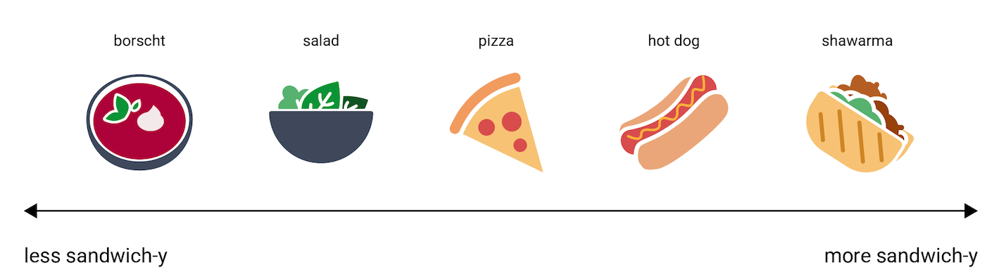
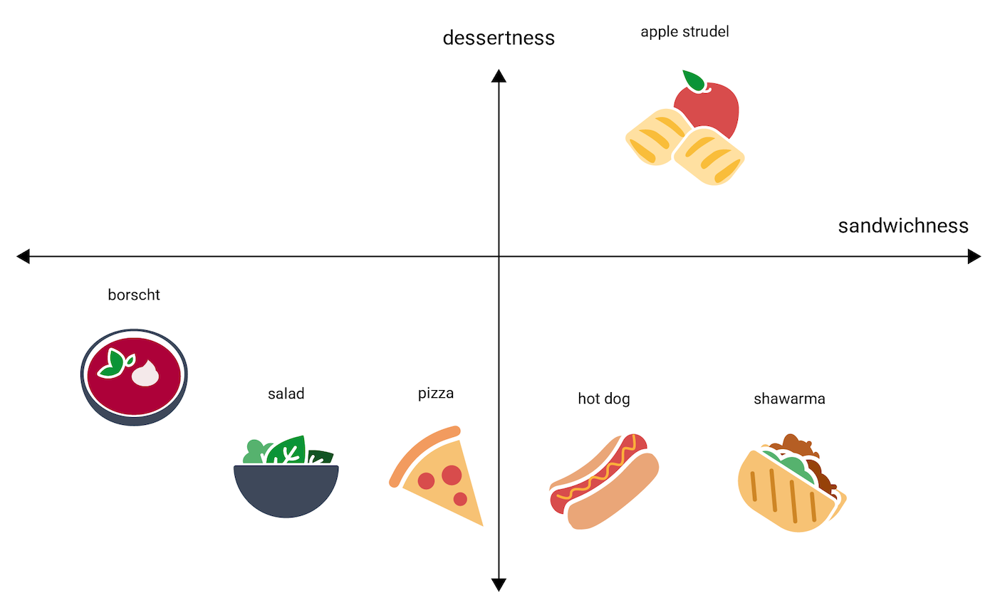
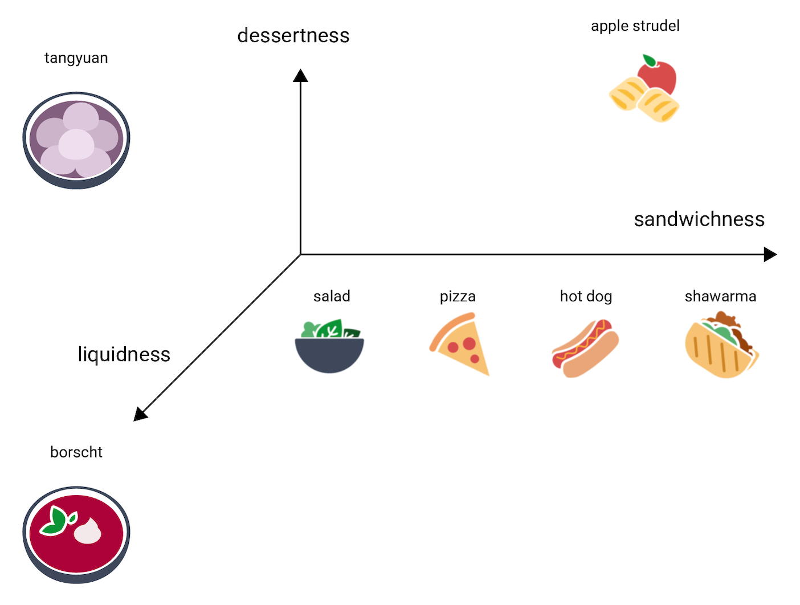

# Text Embedding Dimensionular Extremes
Welcome to another project with zero real meaning! Today I'm exploring text
embeddings. Recently I've been learning about text embeddings working on a
Retrieval Augmented Generation "RAG" project where we search through text to
find relevant documents and feed matching documents to a LLM to provide
summaries. The text embeddings help us match a user query with the relevant
documents.

Text embeddings are simply vectors with numbers, like `[0.0, 0.2, 0.7]`. This
vector has three numbers. You could imagine it representing a point in 3D
space. If you had other 3D points, like `[0, 0, 0]` and `[1, 1, 1]` you could
imagine all three points floating around together. `[0, 0, 0]` is close to the
origin of space, `[1, 1, 1]` is off in some corner of space, and the first vector
exist floating somewhere sort of next the center sort of 

bla bla bla

Recently I've been working with text embeddings. Text embeddings are vectors
representing text where you can compute how similar one piece of text is to
another by 

Basically I've grabbed a dictionary and pared the dictionary down to adjectives
and created a text embedding for each adjective. I'm creating text embeddings
locally with python, Ollama, langchain, and storing them in a Chroma sqlite3
DB. Once the embeddings are created I look up "extremes." I'm interested in

* What word occurs closest to the origin at [0, 0, 0, 0, ...]
* What word occurs closest to [1, 1, 1, 1, 1, 1, 1, 1...]
* What word occurs closest to [-1, -1, -1, -1, -1, -1, ...]
* What word has the highest score for each dimension
* What word has the lowest score for each dimension

The results look like this:

```txt
0s zygosporic
1s unhewn
-1s neuroendocrine

0 -1.0000001192092896 cursed multilevelled 1.0000001192092896
1 -0.9992036819458008 informatory poral 0.9949198961257935
2 -0.9383177161216736 nodular metaphorical 0.9901447296142578
3 -0.9304590225219727 mesonic gradual 0.8135342001914978
4 -0.6609352827072144 cloddiest falculate 0.9781904220581055
5 -0.5535609722137451 regauged lifelong 0.8517701625823975
6 -0.9287737011909485 iontophoretic interallelic 0.5348101854324341
7 -0.67302405834198 basipetal fulvid 0.6279732584953308
...
4086 -0.03673190996050835 mycorhizal nonfarm 0.046019382774829865
4087 -0.026884328573942184 baltic prosecutorial 0.02988828346133232
4088 -0.04415430501103401 antiherpes palmar 0.029156044125556946
4089 -0.023537013679742813 peristaltic unamassed 0.04992534592747688
4090 -0.03186899423599243 reciprocal chromonemal 0.03293108567595482
4091 -0.03652277588844299 insecurest windfallen 0.03749122470617294
4092 -0.029390985146164894 titlike fibrocystic 0.035720836371183395
4093 -0.041142262518405914 impossible candidal 0.035607896745204926
4094 -0.03211917728185654 rectal inaner 0.034314803779125214
4095 -0.029497841373085976 formal precancer 0.039222415536642075
```

## What are Text Embeddings?
Here's a nice explanation from Google about what text embeddings are:

https://developers.google.com/machine-learning/crash-course/embeddings

### One-Dimensional Embeddings


### Two-Dimensional Embeddings


### Three-Dimensional Embeddings



